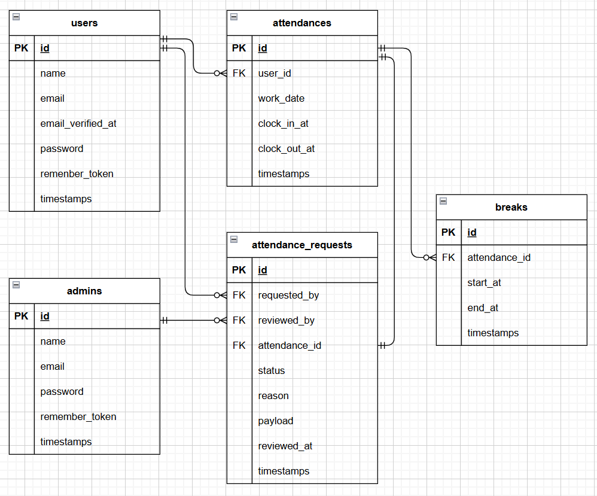

# attendance__myself
## 環境構築
### Dockerビルド
1. git clone git@github.com:akanainoue/attendance__myself.git
2. DockerDesktopアプリを立ち上げる
3. docker-compose up -d --build

### Laravel環境構築
1. docker-compose exec php bash
2. composer install
3. cp .env.example .env
4. アプリケーションキーの作成
    php artisan key:generate
5. マイグレーションの実行
    php artisan migrate
6. シーディングの実行
    php artisan db:seed
<!-- 7. シンボリックリンク作成
    php artisan storage:link -->
    
### 使用技術
+ PHP8.1.33
+ Laravel8.83.29
+ MySQL8.0.26

## ER図

## URL
+ 開発環境：http://localhost/
+ phpMyAdmin:：http://localhost:8080/
+ mailhog: http://localhost:8025/
